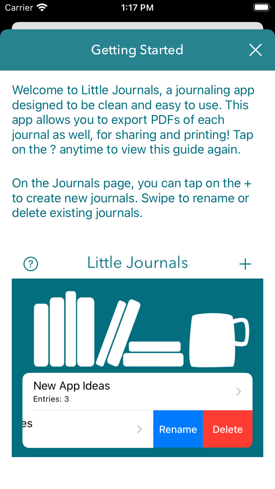
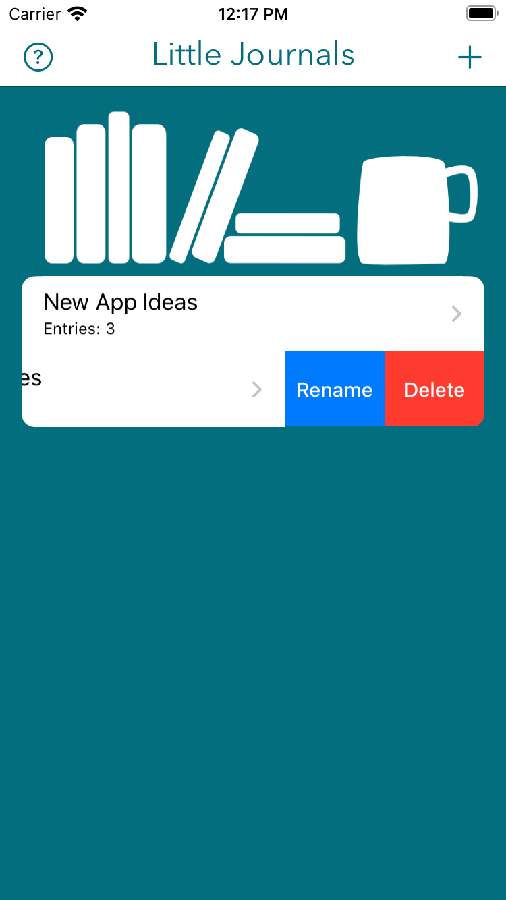
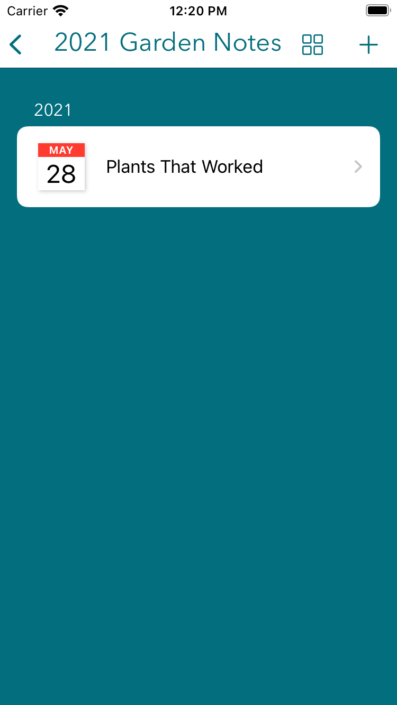
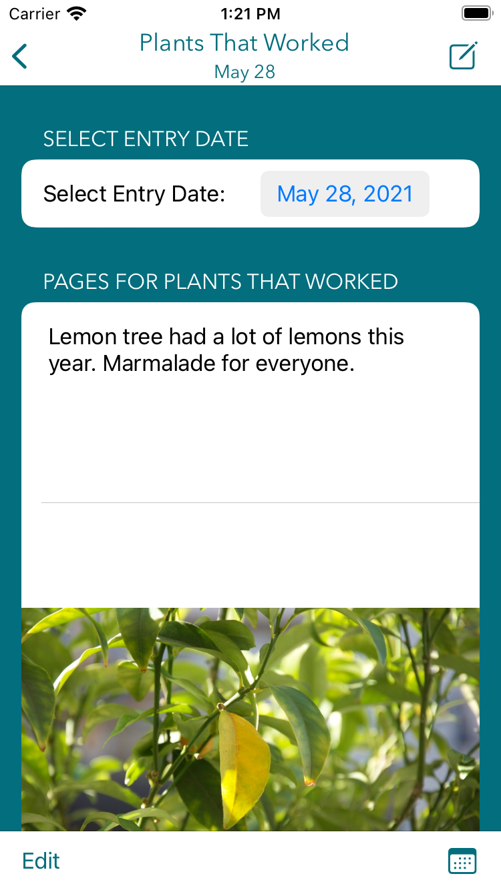
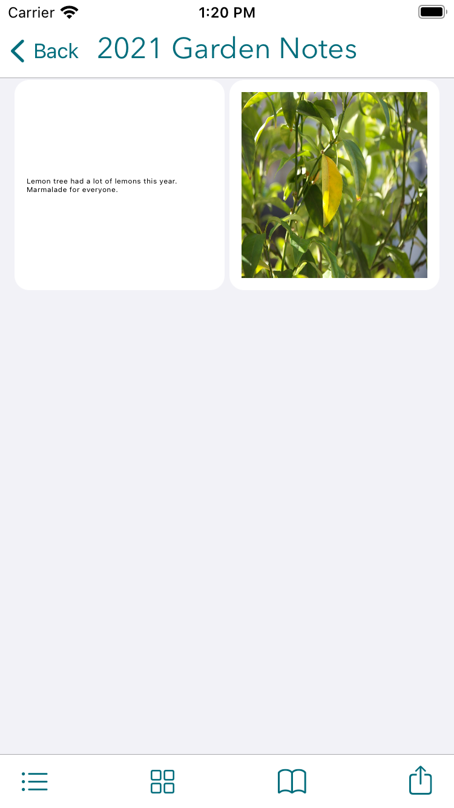

# LittleJournals
## LittleJournals app v1.0, iOS 14.0+.
Written in Swift, using UIKit and locally- and iCloud-saved JSON for persistence and syncing between devices.

### v1.0 Release Notes

This is the latest release of LittleJournals. Features are listed below by each image.

1. The Getting Started page provides an app overview with features and other info, and pops up automatically when the user has no journals added yet.

2. Create, view, rename, and edit journals. Under "Edit", you can select a cover title, cover image, and change the color of the title text.

3. Create, view, rename, and edit entries in a journal. Entries are automatically sorted by date (shown).

4. Add text, image, and gallery pages to an entry. Edit and reorder existing pages.

5. View all of a journal's pages, either in a scrollable grid or paginated. Export as a PDF to print or share!

