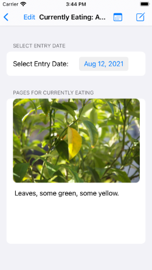
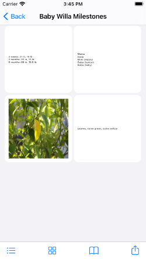
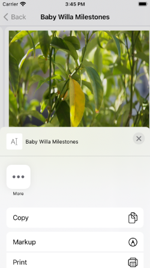

# LittleJournals
## LittleJournals app v0.2 (beta), iOS 13.0+.
Written in Swift, using UIKit and locally-saved JSON for persistence.

### v0.2 MVP Release Notes
This is the MVP release of LittleJournals. Features are listed below by each image.

1. Create, view, rename, and edit journals

2. Create, view, rename, and edit entries in a journal. Entries are sorted by date (shown).

3. Add text-only or image-only pages to an entry, or edit existing ones. "Edit" button enables reordering of pages.

4. Add text or image pages to an entry.

5. View all of a journal's pages, either in a scrollable grid or paginated.

6. Export the pages of a journal as a minimally-formatted (for now) PDF.

